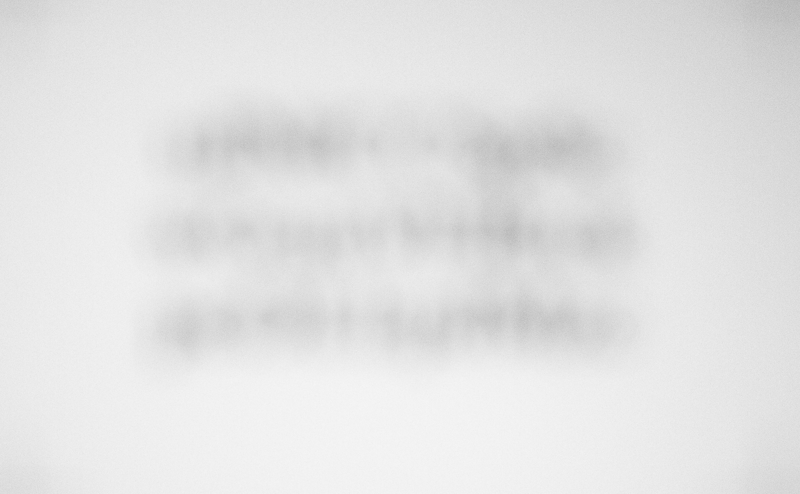
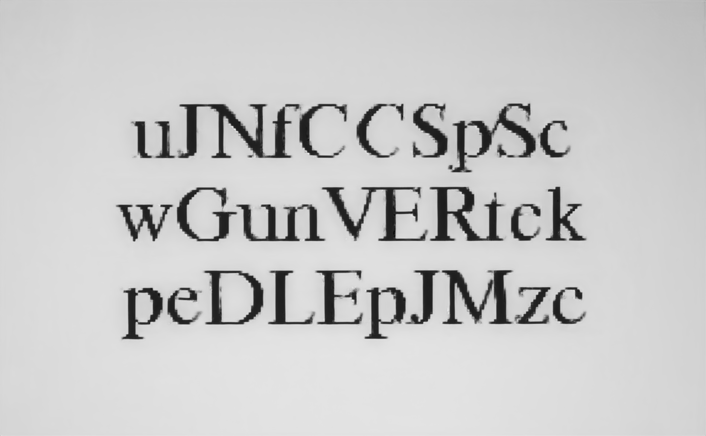
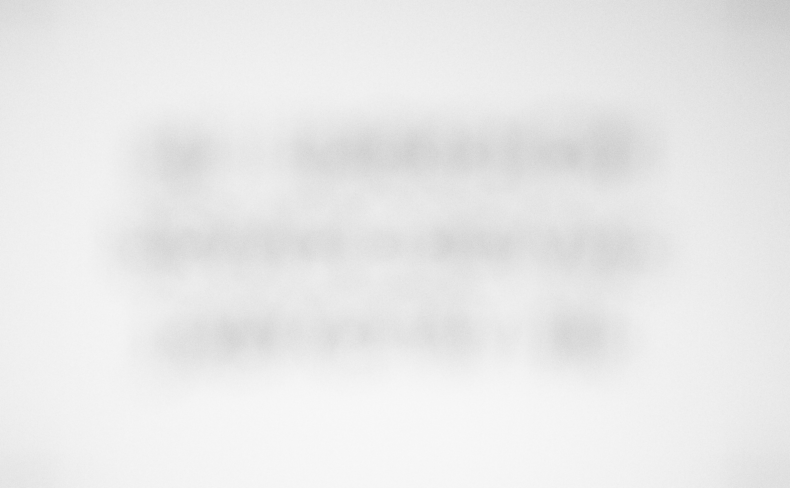
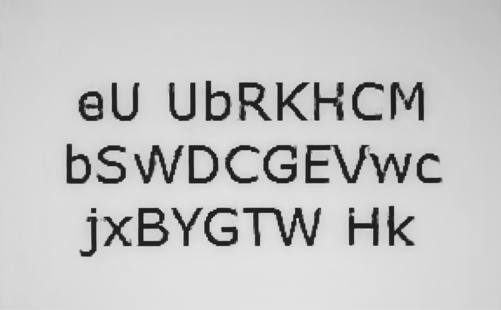

# Code for Helsinki Deblur Challenge 2021
## Authors, institution, location.
Below is the information for the authors.
 + *Author*       Weixi Wang
 + *Institution*  Department of Mathematics, National University of Singapore
 + *Location*.    21 Lower Kent Ridge Rd, Singapore 119077    
## Brief description of your algorithm and a mention of the competition.
 Our deblurring algorithm is a deep learning approach, as there have been provided the training datasets. Our deblurring network backbone is on the widely used U-net.oThe difference is that in each original layer we add an attention layer to help the deconvolution process.
 
 For this task, the blurring level is very high. And we find in the training stage, it is hard to decrease the training loss. To address such issue, we proposed the following modifications:
 + To increase the receptive field of deblurring, we propose two-stage approach to deblur the text image: We first downscale the blurred input, and train the *deblur network* using the downscaled truth image. After the deblur network does well for deblurring the downscaled input. We then train a *super resolution network* to enlarge the image size. At last, we finetune the two networks using the datasets.


** Installation instructions, including any requirements.
See the +requirement.txt+ to install the dependent packages and librairies.
 ## Installation instructions, including any requirements.
See the ```requirement.txt``` to install the dependent packages and librairies.

 ## Usage instructions.
 + Clone the github repository
   
   ```python 
   git clone https://github.com/Wang-weixi/HDC2021.git

   cd HDC2021
   ```
 + Use ```conda```  constrcut the virtual environment
    ```python
    pip3 install virtualenv
    virtualenv --no-site-packages --python=python3 HDC2021
    source HDC2021/bin/activate # enter the vironment
    pip3 install -r requirements.txt # install the dependency 
    deactivate
    ```

 ## Show a few examples.
Below we show two exmaples of our deblurring performance
 + Input image is `step14/Times/CAM02/focusStep_14_timesR_size_30_sample_0100.tif`, the input is:
    
    and deblurred image is
    

 + Input image is `step19/Verdana/CAM02/focusStep_19_verdanaRef_size_30_sample_0100.tif`, the input is:
    
    and deblurred image is
    


** Usage instructions.
Show a few examples.
